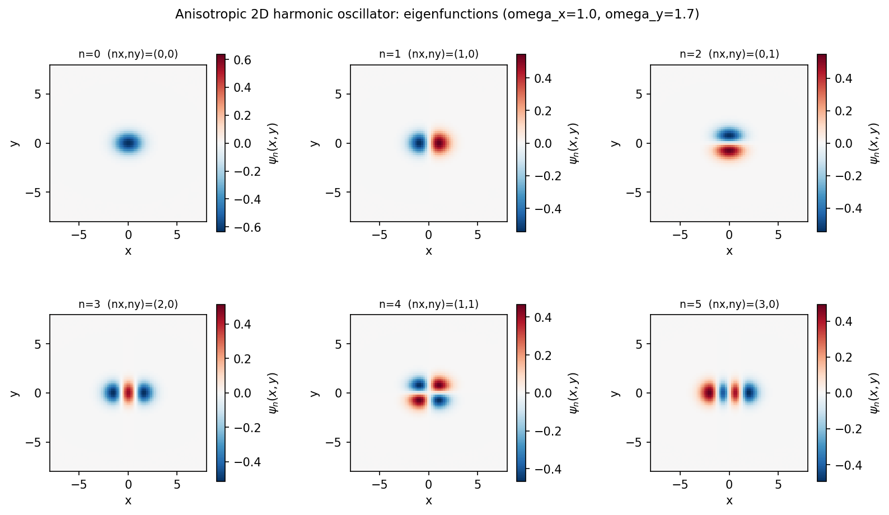
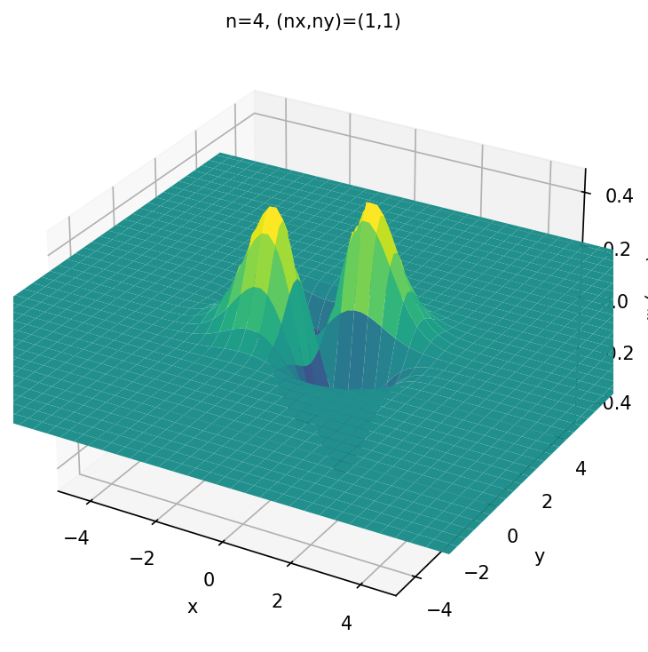
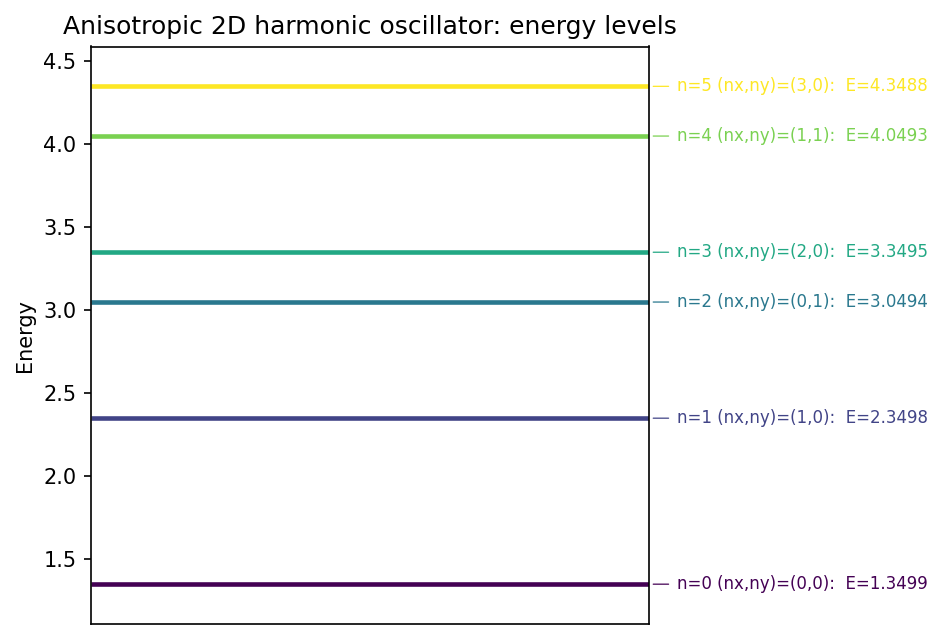
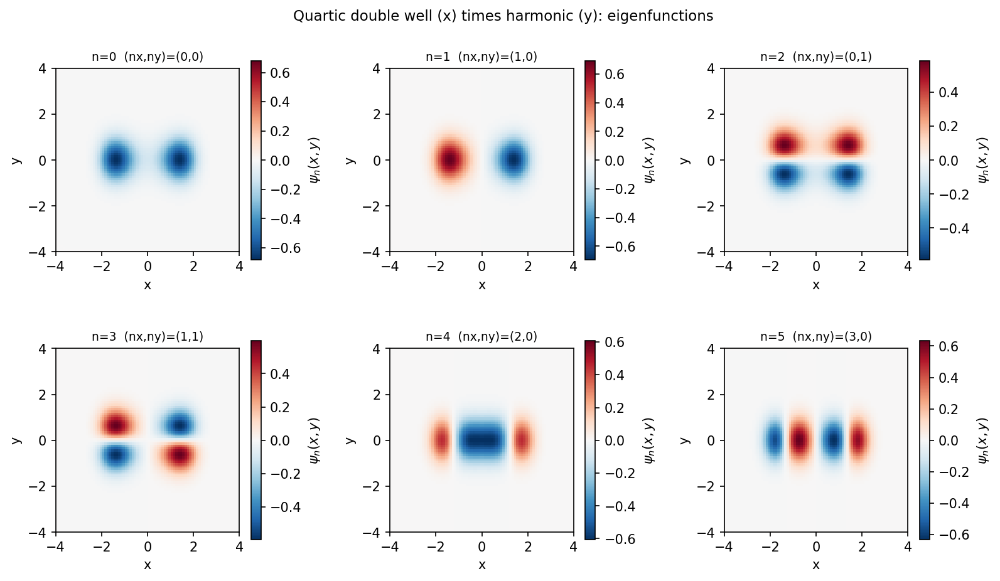
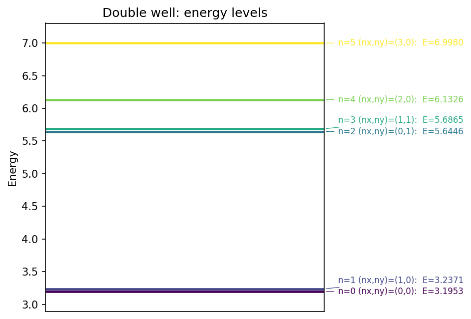
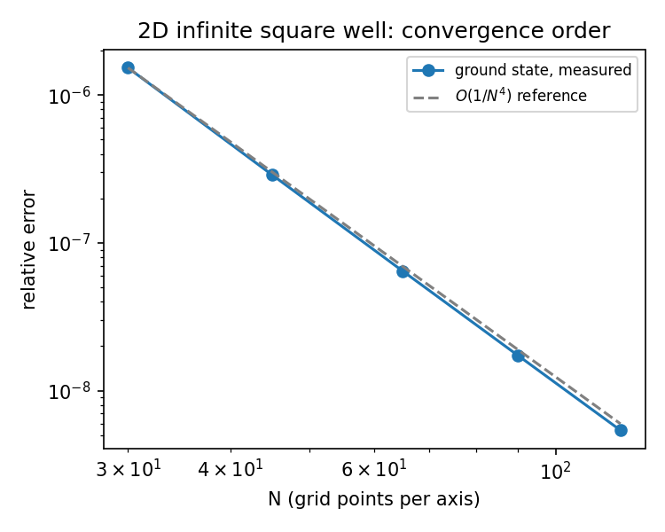
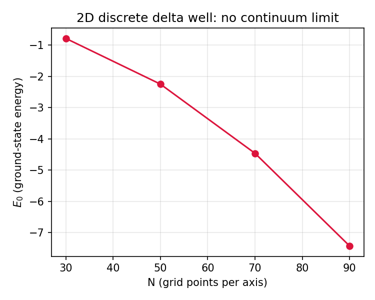

# Eigensolver 2D

This is the two-dimensional extension of my [1D Schrodinger eigensolver](https://github.com/Chumita003/1D_SchrodingerEigensolver): same finite-difference philosophy, now for $H = -\tfrac{\hbar^2}{2m}(\partial_x^2+\partial_y^2) + V(x,y)$. I discretize x and y on a grid, build the kinetic energy operator by reusing the exact same 5-point 1D stencil along each axis and combining them into a 2D Laplacian with a Kronecker sum, add the potential as a diagonal matrix, and diagonalize the resulting sparse Hamiltonian with `scipy.sparse.linalg.eigsh` to get the lowest energies and wavefunctions. I did not assume the 2D code inherits the 1D solver's behavior just because it reuses its stencil. I went through it from scratch and checked the things that could plausibly be different in two dimensions, some carried over exactly as expected, one turned out to be a genuinely different and more severe problem than anything in the 1D project.

`Eigensolver_2Dimensions.py` has the solver (`Schrodinger_solver_2D`), 9 potentials mirroring the 1D set, and plotting functions for heatmaps, a 3D surface, and an energy-level diagram. `validate_2d.py` runs the checks against analytic solutions. `demo_figures.py` regenerates the gallery figures below. `Eigensolver_2Dimensions.ipynb` is the working notebook. `Eigensolver_2Dimensions.pdf` is my handwritten derivation of the 2D stencil and the separable analytic spectra.

## Anisotropic harmonic oscillator

The natural first check: $V(x,y) = \tfrac12 m(\omega_x^2 x^2 + \omega_y^2 y^2)$, separable by construction, with exact spectrum $E_{n_x,n_y} = \hbar\omega_x(n_x+\tfrac12) + \hbar\omega_y(n_y+\tfrac12)$. I used $\omega_x=1.0$, $\omega_y=1.7$ here on purpose instead of the more obvious isotropic case, for a reason I get to further down. Here are the first six eigenfunctions:



I checked the node count along x and along y for each panel against the $(n_x,n_y)$ it's supposed to be, they match exactly: (0,0), (1,0), (0,1), (2,0), (1,1), (3,0), in that energy order. A heatmap hides the actual amplitude profile behind flat colors, so here's one state, $n=4$, as a surface instead:



And the energy-level diagram:



## Double well in x, harmonic in y

$V(x,y) = V_x(x^2-a^2)^2 + V_y y^2$ is the case I enjoy showing most, same reason as in the 1D project: no closed form, and it displays real physics. With $a=1.5$, $V_x=1.0$, $V_y=3.0$:





Because the potential is separable, $E = E_x + E_y$, so the spectrum should come out as copies of the 1D double-well tunneling doublet, one copy per y-quantum, all shifted by the same amount. That's exactly what I measured: the $n=0,1$ doublet splits by $4.1817\times10^{-2}$, and the $n=2,3$ doublet, which is the same x-physics but with one quantum of y-motion added on top, splits by $4.1817\times10^{-2}$ too, to five decimal places. The gap between the two doublets is $2.4494$, matching $\omega_y=\sqrt{2V_y/m}=\sqrt{6}=2.4495$ up to the same grid error the rest of this project runs into. I didn't expect to get a clean cross-check like that out of a demo figure, but separability is a real, checkable prediction and the solver reproduces it.

## Validation against analytic solutions

I checked two potentials with closed-form spectra: a rectangular infinite well ($L_x=12$, $L_y=8$, $\hbar=m=1$, $E_{n_x,n_y}=\tfrac{\pi^2\hbar^2}{2m}(n_x^2/L_x^2+n_y^2/L_y^2)$) and the anisotropic oscillator above. Both use $N=90$ grid points per axis.

```
Infinite square well, Lx=12, Ly=8         Harmonic osc., wx=1, wy=1.7
 n     numeric     analytic   rel.err      n     numeric     analytic   rel.err
 0   0.11176380  0.11137574  3.484e-03     0   1.34993665  1.35000000  4.693e-05
 1   0.21492984  0.21418412  3.482e-03     1   2.34987222  2.35000000  5.437e-05
 2   0.34388740  0.34269460  3.481e-03     2   3.04962285  3.05000000  1.237e-04
 3   0.38687121  0.38553142  3.475e-03     3   3.34967973  3.35000000  9.560e-05
 4   0.44705344  0.44550298  3.480e-03     4   4.04955842  4.05000000  1.090e-04
 5   0.61899480  0.61685028  3.477e-03     5   4.34927537  4.35000000  1.666e-04
```

Same story as the 1D project: the oscillator sits three orders of magnitude tighter than the square well, and the square well's error is flat across every level rather than growing with $n$. That flatness is the boundary-stencil limitation again, now in two dimensions.

## The boundary accuracy limit, carried over from 1D

The 5-point stencil is fourth order in the interior, but the two rows adjacent to each Dirichlet boundary need a point one step past the edge of the domain that doesn't exist. Using the correct one-sided formula there would break the symmetry of the Hamiltonian matrix, so, exactly as in the 1D project, I kept the uniform central stencil everywhere and accepted that those boundary rows drop to second order locally. I didn't assume this carries over unchanged to 2D just because it's the same stencil, I checked it: I swept the grid resolution for the (now isotropic, $L=10$) square well's ground state and measured the convergence order directly.



The measured points track $O(1/N)$, not $O(1/N^4)$, with a fitted local slope between $-1.03$ and $-1.02$ across the whole sweep (it eases slightly toward $-1.0$ as $N$ grows, exactly what you'd expect as the $1/N$ term starts to dominate more cleanly). Same signature as the 1D result, and the mechanism is identical: it's not a new 2D bug, it's the same truncated boundary rows, just now happening independently along x and along y. The oscillator barely notices, for the same reason it doesn't in 1D: its wavefunctions have decayed to essentially zero long before reaching the domain edge.

## Two things that are genuinely new in 2D

Degenerate eigenvalues and Krylov methods don't mix well. I originally set up the harmonic oscillator demo with $\omega_x=\omega_y$, the more natural isotropic case, and the eigenvectors came out wrong: for the $n=1,2$ pair, which should be the separable states $(1,0)$ and $(0,1)$, `eigh` instead returned something close to their symmetric and antisymmetric combinations. That's not a bug, it's mathematically unavoidable. `eigsh` (and Lanczos/Arnoldi methods in general) build their whole approximation from repeatedly applying $H$ to a single starting vector. If $H$ has an eigenvalue with multiplicity 2, every power of $H$ applied to that vector, restricted to that 2D eigenspace, stays proportional to the same one direction, the projection of the starting vector onto the eigenspace. No amount of iterating recovers the second, orthogonal direction from a single starting vector. I confirmed this isn't just a quirk of my own `eigh` cross-check by writing a small matrix-free Lanczos solver from scratch (not part of this repo, just a sandbox check) and running it on the same isotropic potential: it silently returned only one eigenvalue per degenerate pair and substituted a higher, non-degenerate one in its place instead of flagging anything. `eigsh` is a more sophisticated implementation of the same underlying method (implicitly restarted Lanczos), so it inherits the same limitation in principle. This is why every validated result and every demo figure in this README uses anisotropic frequencies or a non-square well: it sidesteps the question entirely instead of hoping floating-point noise happens to save it.

The 2D discrete delta well has no continuum limit. In 1D, `V_DeltaDiscrete` converges (slowly, see the 1D README) to the exact bound-state energy $E=-m\alpha^2/2\hbar^2$ as the grid is refined. I assumed the 2D version, `V_DeltaDiscrete_2D`, would do the same thing, just slower. It doesn't. I measured the ground-state energy as a function of grid resolution and it does not settle down, it keeps getting more negative:



```
N       E0
30    -0.788
50    -2.250
70    -4.462
90    -7.424
```

This isn't a discretization artifact I need a finer grid to fix. The continuum 2D Dirac delta potential is a well known pathological case in quantum mechanics: unlike 1D, where the delta well has a clean, regularization-free formula, the 2D delta has no natural bound-state energy scale on its own, the problem needs an explicit regularization (a cutoff or a renormalized coupling) to have a well-defined answer at all, and the energy runs logarithmically with that cutoff. (The 3D delta potential has its own, differently-structured version of this same problem, it isn't "clean" either, so the honest contrast is with 1D specifically, not with 1D and 3D together.) Here the grid spacing $dx$ is playing the role of that cutoff, so refining the grid doesn't converge toward a hidden true value, it just changes the effective regularization: I checked this directly by fitting the measured $E_0$ against $1/dx^2$, and $E_0 \cdot dx^2$ comes out to $-0.375$ at every single grid resolution I tried (N=30 to N=90, a factor of 3 in $dx$), confirming the divergence is a clean $E_0 \propto -1/dx^2$ law, not noise. That law itself makes sense dimensionally: the discrete delta's depth is $V_0=\alpha/dx^2$, proportional to the grid's own natural kinetic-energy scale $\hbar^2/(m\,dx^2)$ with a fixed, $dx$-independent ratio (since I hold $\alpha$ fixed), so the bound-state energy has no choice but to scale the same way. I kept `V_DeltaDiscrete_2D` in the code because it's still a legitimate, well-defined discrete Hamiltonian for any fixed $N$, and because running into this by actually checking the numbers, instead of assuming the 1D result would just carry over, is a more honest outcome than pretending it isn't there.

## What's in the repo

`Eigensolver_2Dimensions.py` has `Schrodinger_solver_2D`, the 9 potentials, and the plotting functions (`plot_eigenfunction_heatmap`, `plot_eigenfunction_grid`, `plot_eigenfunction_surface`, `plot_energy_levels_2d`). `validate_2d.py` runs the analytic comparisons, the convergence sweep, and the delta-well divergence study. `demo_figures.py` regenerates the five gallery figures. `tests/test_eigensolver.py` pins down all of the above as regression tests, including the delta well's divergence direction, so a future change that accidentally "fixes" it gets flagged instead of quietly accepted. `Eigensolver_2Dimensions.ipynb` is the demo notebook. `Eigensolver_2Dimensions.pdf` is my handwritten derivation of the 2D stencil, the Kronecker-sum construction, and the separable analytic spectra.

To run it:

```
pip install -r requirements.txt
python demo_figures.py
python validate_2d.py
pytest
```

## Scope

Like the 1D project, this uses a low-to-mid-order finite-difference scheme and standard sparse diagonalization, no shift-invert, no acceleration for large domains, and the same $O(1/N)$ boundary ceiling. In 2D the grid cost also grows as $N^2$ instead of $N$, so it scales worse and I kept the default resolutions here more modest than I might otherwise. It's not a production package, it's the tool I built to actually understand how the 1D approach extends to two dimensions, and to find out which parts of that extension are trivial and which parts aren't just by checking, not by assuming.
